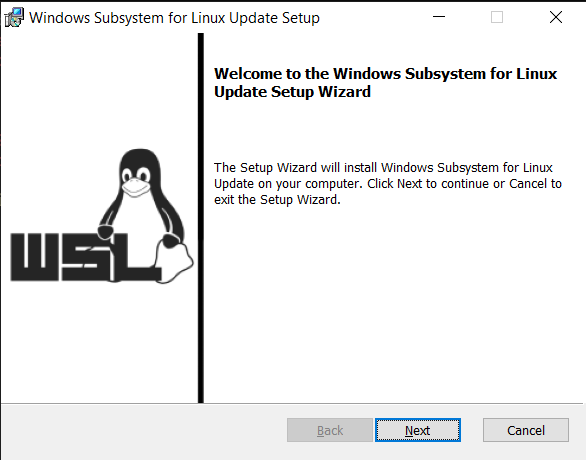
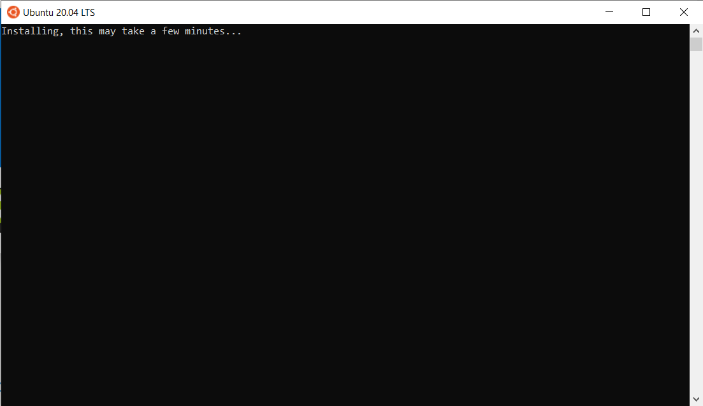
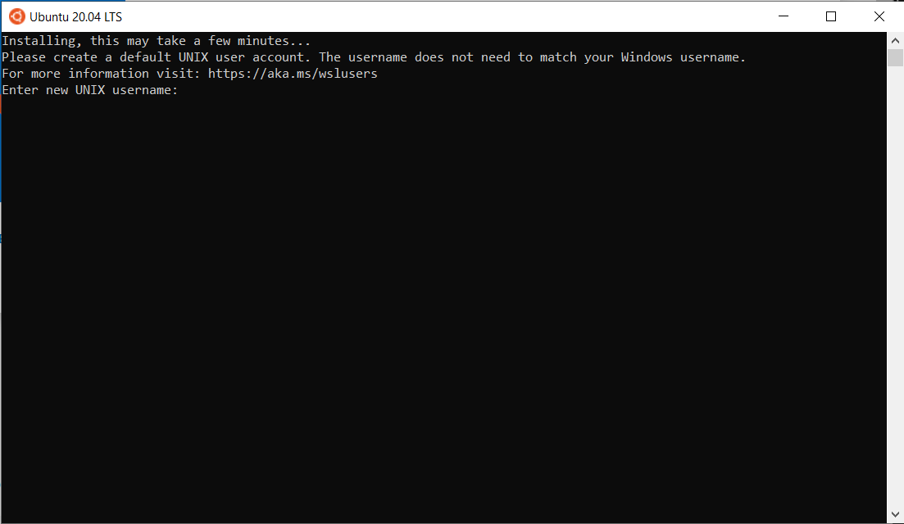
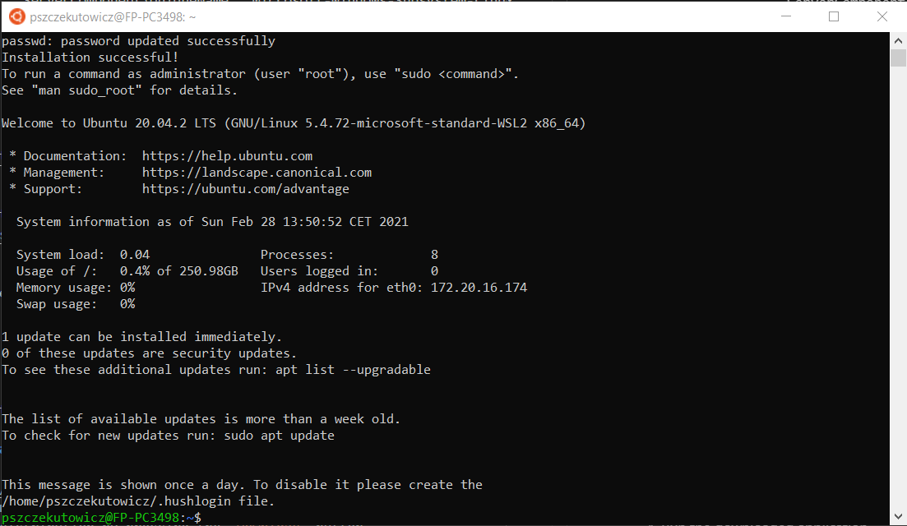
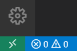
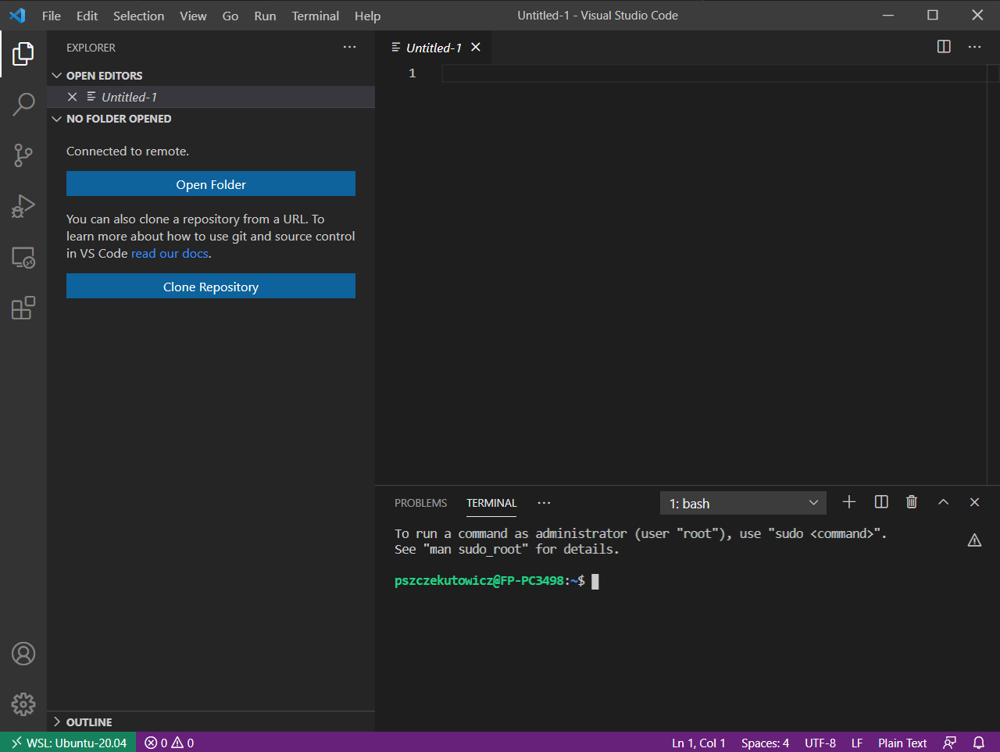
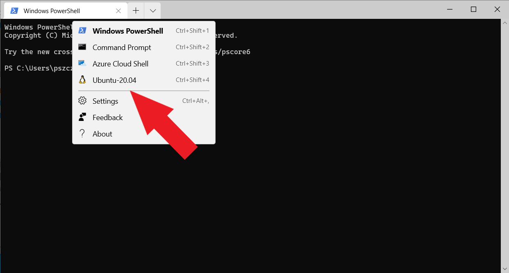

# Docker Engine on WSL2

## Windows 10 Configuration

All commands should be run in shell with __administrator privileges__.
PowerShell was used to run the commands

### Step 1. Enable Virtual Machine Platform

Execute the following command to enable Virtual Machine Platform
```shell
Enable-WindowsOptionalFeature -Online -FeatureName VirtualMachinePlatform
```

The following question will be displayed during the subsystem installation.
Select `Yes` to perform the full installation during reboot.
```
Do you want to restart the computer to complete this operation now?
[Y] Yes  [N] No  [?] Help (default is "Y"):
```

After a reboot, you can ensure that the platform has been properly enabled by running the following command.
```
Get-WindowsOptionalFeature -Online -FeatureName VirtualMachinePlatform
```

An example of the correct result of a command:
```
FeatureName      : VirtualMachinePlatform
DisplayName      : Virtual Machine Platform
Description      : Enables platform support for virtual machines
RestartRequired  : Possible
State            : Enabled
CustomProperties :
```

### Step 2. Enable Microsoft Windows Subsystem Linux

Execute the following command to enable Microsoft Windows Subsystem Linux
```
Enable-WindowsOptionalFeature -Online -FeatureName Microsoft-Windows-Subsystem-Linux
```
The following question will be displayed during the subsystem installation.
Select `Yes` to perform the full installation during reboot
```
Do you want to restart the computer to complete this operation now?
[Y] Yes  [N] No  [?] Help (default is "Y"):
```

After a reboot, you can ensure that the subsystem has been properly enabled by running the following command.
```
Get-WindowsOptionalFeature -Online -FeatureName Microsoft-Windows-Subsystem-Linux
```

An example of the correct result of a command:
```
FeatureName      : Microsoft-Windows-Subsystem-Linux
DisplayName      : Windows Subsystem for Linux
Description      : Provides services and environments for running native user-mode Linux shells and tools on Windows.
RestartRequired  : Possible
State            : Enabled
CustomProperties :
                   ServerComponent\Description : Provides services and environments for running native user-mode Linux
                   shells and tools on Windows.
                   ServerComponent\DisplayName : Windows Subsystem for Linux
                   ServerComponent\Id : 1033
                   ServerComponent\Type : Feature
                   ServerComponent\UniqueName : Microsoft-Windows-Subsystem-Linux
                   ServerComponent\Deploys\Update\Name : Microsoft-Windows-Subsystem-Linux
```

### Step 3. WSL2 Kernel Update

An update to the kernel component of the WSL 2 subsystem is required. For more information visit: https://aka.ms/wsl2kernel, https://docs.microsoft.com/pl-pl/windows/wsl/wsl2-kernel

Download and execute following file:\
 https://wslstorestorage.blob.core.windows.net/wslblob/wsl_update_x64.msi



Press `Next`. After the installation is complete, press `Finish`.

**Important!**

To make each newly installed distribution start in wsl2 by default, run the
following command:
```
wsl --set-default-version 2
```

If you already have any distribution installed and want to upgrade to wsl2,
run the following command
```
wsl --set-version <distro-name> 2
```


### Step 4. Install Ubuntu

1. Visit https://www.microsoft.com/pl-pl/p/ubuntu-2004-lts/9n6svws3rx71
1. Press `Get` and then `Open Microsoft Store`.
1. Download the distribution by pressing the `Download` button
1. Run the downloaded application
   
1. Enter new UNIX username (new user will be created in Ubuntu)
   
1. Enter password for new username
1. Ubuntu installation is complete
   

## Docker Engine

Choose and execute one of the available installation methods:

### Scripted installation

1. Start WSL session\
   `wsl`
1. Execute **[setup.sh](./setup.sh)** script\
   `./setup.sh`
1. Stop WSL session\
   `logout`
1. Start WSL session\
   `wsl`
1. Check server version\
   `docker info  --format "{{.ServerVersion}}"`\
   Expected output:\
   `xx.xx.x`

### Manual installation

1. Start WSL session\
   `wsl`
1. Download PGP Public Key\
   `curl -fsSL https://download.docker.com/linux/ubuntu/gpg | sudo gpg --quiet --dearmor -o /usr/share/keyrings/docker-archive-keyring.gpg`
1. Add APT source list\
   `echo "deb [arch=amd64 signed-by=/usr/share/keyrings/docker-archive-keyring.gpg] https://download.docker.com/linux/ubuntu $(lsb_release -cs) stable" | sudo tee /etc/apt/sources.list.d/docker.list`
1. Update APT package information\
   `sudo apt update --yes`
1. Install Docker Community Edition\
   `sudo apt install --yes docker-ce`
1. Add current user do the `docker` group\
   `sudo usermod -aG docker $(whoami)`
1. Stop WSL session\
   `logout`
1. Start WSL session\
   `wsl`
1. Start Docker service\
   `sudo service docker start`
1. Check server version\
   `docker info  --format "{{.ServerVersion}}"`\
   Expected output:\
   `xx.xx.x`

### Ubuntu 20.10+ nftables issue

In ubuntu 20.10* due to incompatibility of Docker Engine with nftables, legacy
iptables should be used. To switch default iptables execute the following command and choose **iptables-legacy**
```
sudo update-alternatives --config iptables
```

## Visual Studio Code

Download, install and run Visual Studio Code\
https://code.visualstudio.com/Download

### Remote - WSL

1. Install [Remote WSL](https://marketplace.visualstudio.com/items?itemName=ms-vscode-remote.remote-wsl) extension.\
   (Press `ctrl+p` and execute `ext install ms-vscode-remote.remote-wsl`)
1. In the bottom left corner, press the green button\
   
1. Select `Remote WSL: New Window`\
   

### Windows terminal

1. Download and install Windows Terminal\
   https://www.microsoft.com/en-us/p/windows-terminal/9n0dx20hk701
1. Open Windows Terminal and select Ubuntu
   

### Recomended plugins

- [Docker](https://marketplace.visualstudio.com/items?itemName=ms-azuretools.vscode-docker)

## First Container

1. In Ubuntu execute following command
   ```
   docker run -d -p 80:80 docker/getting-started
   ```

   Expected output example
   ```
   Unable to find image 'docker/getting-started:latest' locally
   latest: Pulling from docker/getting-started
   aad63a933944: Pull complete
   b14da7a62044: Pull complete
   343784d40d66: Pull complete
   6f617e610986: Pull complete
   Digest: sha256:d2c4fb0641519ea208f20ab03dc40ec2a5a53fdfbccca90bef14f870158ed577
   Status: Downloaded newer image for docker/getting-started:latest
   ad77e95c178b1bdd3c752b45223e40b2f9a964a99cd6ee611043805518631d42
   ```
1.  Visit http://localhost/tutorial
