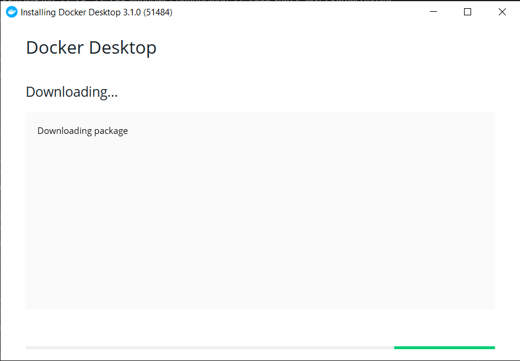
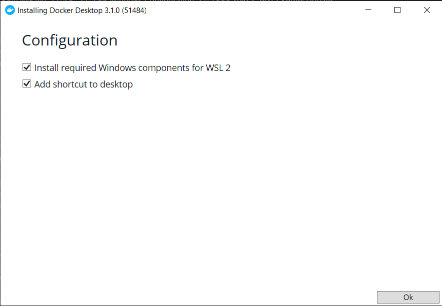
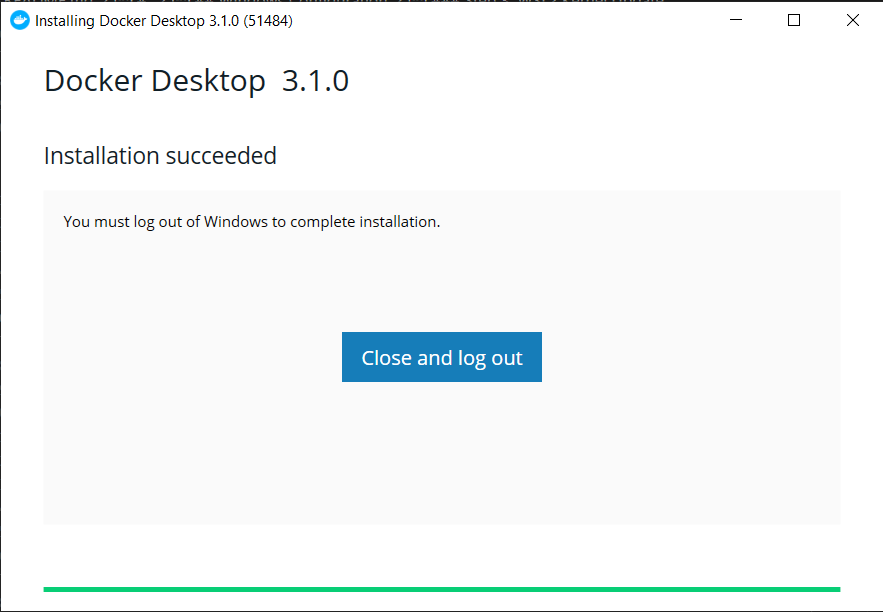

## Docker Desktop

1. Download and execute following file:\
   https://download.docker.com/win/stable/Docker%20Desktop%20Installer.exe
   
1. Go through the installer leaving the default settings. WSL2 will be automatically detected.
   
1. Press `Close and log out` after successfully installation.
   
